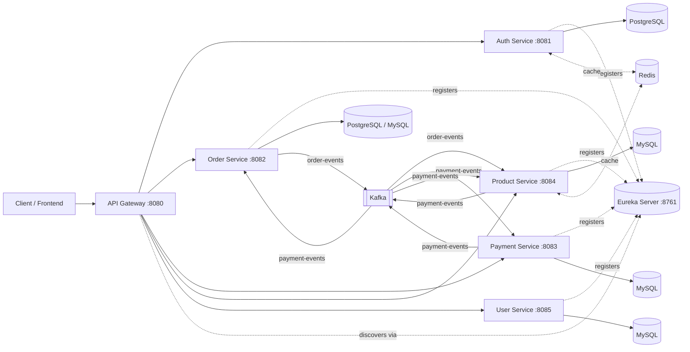
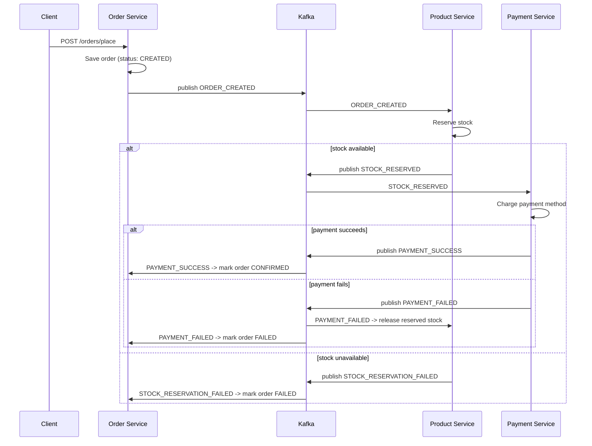

# 🛒 ECom Microservices Platform

A distributed e-commerce backend built as a set of independently deployable
Spring Boot microservices, coordinated through an API Gateway, service
discovery, and an event-driven saga over Apache Kafka.

> **Note on this README:** this document describes the platform's intended,
> end-state architecture — the target this codebase is being built toward.
> Some pieces described here (marked with 🚧) are still in progress. See
> [Roadmap](#-roadmap--known-gaps) for exactly what's implemented today vs.
> what's planned.

---

## Table of Contents

1. [Architecture Overview](#-architecture-overview)
2. [High-Level Design (HLD)](#-high-level-design-hld)
3. [Service-Level Low-Level Design (LLD)](#-service-level-low-level-design-lld)
   - [API Gateway](#1-api-gateway)
   - [Auth Service](#2-auth-service)
   - [User Service](#3-user-service)
   - [Product Service](#4-product-service)
   - [Order Service](#5-order-service)
   - [Payment Service](#6-payment-service)
   - [Eureka Service Discovery](#7-eureka-service-discovery)
4. [Event-Driven Architecture](#-event-driven-architecture)
5. [Database Schema](#-database-schema)
6. [Resilience Patterns](#-resilience-patterns)
7. [Deployment](#-deployment)

---

## 📐 Architecture Overview


_Figure 1: High-level system architecture showing all microservices and their interactions_



Every business service is independent, owns its own database, registers
itself with **Eureka** for discovery, and is reachable only through the
**API Gateway**. Services never call each other synchronously for anything
that isn't a direct read — cross-service workflows (like placing an order)
are coordinated asynchronously through **Kafka**, using a choreography-based
saga so that no single service needs to know about the others' internals.

---

## 🧩 Services

| Service                     | Port | Responsibility                                                             | Datastore         |
| --------------------------- | ---- | -------------------------------------------------------------------------- | ----------------- |
| **Eureka Server**           | 8761 | Service registry / discovery                                               | —                 |
| **API Gateway**             | 8080 | Single entry point, routing, JWT pass-through                              | —                 |
| **Auth Service**            | 8081 | Registration, login, OTP email verification, JWT issuance, role management | PostgreSQL, Redis |
| **User Service**            | 8085 | User profile data                                                          | MySQL             |
| **Product Service**         | 8084 | Product catalog, bag/cart, watchlist, stock reservation                    | MySQL, Redis      |
| **Order Service**           | 8082 | Order lifecycle, addresses, saga orchestration (producer side)             | PostgreSQL/MySQL  |
| **Payment Service**         | 8083 | Payment processing, payment history                                        | MySQL             |
| **Notification Service** 🚧 | 8086 | Order/payment/shipping emails, driven by Kafka events                      | —                 |

---

## 🔄 Order Saga (Event-Driven Flow)

Placing an order is a distributed transaction across three services,
coordinated entirely through Kafka events rather than direct REST calls —
this keeps services decoupled and lets each step fail independently
without taking the whole flow down.



Every event carries an `orderId` so any service can trace a full order's
path across the log, and every "forward" step has a corresponding
compensating event so the saga can unwind cleanly on failure instead of
leaving stock reserved or payments orphaned.

---

## 🛠️ Tech Stack

- **Language / Framework:** Java 17+, Spring Boot 3.x
- **Security:** Spring Security, JWT (stateless auth)
- **Service Discovery:** Netflix Eureka
- **Gateway:** Spring Cloud Gateway (WebMVC)
- **Messaging:** Apache Kafka
- **Persistence:** Spring Data JPA, PostgreSQL, MySQL
- **Caching:** Redis
- **Build:** Maven
- **Containerization:** Docker, Docker Compose 🚧
- **API Docs:** springdoc-openapi (Swagger UI) 🚧
- **Testing:** JUnit 5, Mockito
- **Observability:** Micrometer Tracing + Zipkin 🚧, centralized logging 🚧

---

## 🚀 Getting Started

### Prerequisites

- Java 17+
- Maven 3.9+
- Docker & Docker Compose 🚧
- PostgreSQL, MySQL, Redis, and a running Kafka broker (or use the
  docker-compose stack below once available)

### Run everything with Docker Compose 🚧

```bash
docker compose up -d
```

This will start Zookeeper/Kafka, PostgreSQL, MySQL, Redis, Eureka, the
Gateway, and all five business services, in the correct order.

### Run manually (current state)

Start infrastructure (Postgres, MySQL, Redis, Kafka) yourself, then bring
services up in this order so registration/discovery works cleanly:

```bash
# 1. Service registry
cd EurekaClient/EurekaServer && ./mvnw spring-boot:run

# 2. Gateway
cd Api-Gateway && ./mvnw spring-boot:run

# 3. Business services (any order, each depends only on Eureka + its DB)
cd AuthServices/AuthServices && ./mvnw spring-boot:run
cd UserServices/UserServices && ./mvnw spring-boot:run
cd ProductsServices/ProductsServices && ./mvnw spring-boot:run
cd OrdersServices/OrdersServices && ./mvnw spring-boot:run
cd PaymentServices/PaymentServices && ./mvnw spring-boot:run
```

All routes are then reachable through the gateway at `http://localhost:8080`,
e.g. `http://localhost:8080/products/Allproducts`.

### Environment Variables

Each service reads its secrets from the environment (never commit real
values — use a local `.env` file, excluded via `.gitignore`).

| Variable                                                   | Used by                             | Example                            |
| ---------------------------------------------------------- | ----------------------------------- | ---------------------------------- |
| `DB_URL` / `ECOMDB_URL`                                    | all services                        | `jdbc:postgresql://localhost:5432` |
| `DB_USERNAME` / `ECOMDB_USERNAME`                          | all services                        | `postgres`                         |
| `DB_PASSWORD` / `ECOMDB_PASSWORD`                          | all services                        | `••••••••`                         |
| `JWT_SECRET`                                               | Auth, Order, Payment, Product, User | 256-bit+ random string             |
| `JWT_EXPIRATION`                                           | Auth, Order, Payment, Product, User | `86400` (seconds)                  |
| `MAIL_HOST`, `MAIL_PORT`, `MAIL_USERNAME`, `MAIL_PASSWORD` | Auth                                | SMTP creds for OTP email           |

---

## 📡 API Documentation 🚧

Each service exposes interactive Swagger docs once `springdoc-openapi` is
added:

| Service | Swagger UI                              |
| ------- | --------------------------------------- |
| Auth    | `http://localhost:8081/swagger-ui.html` |
| Order   | `http://localhost:8082/swagger-ui.html` |
| Payment | `http://localhost:8083/swagger-ui.html` |
| Product | `http://localhost:8084/swagger-ui.html` |
| User    | `http://localhost:8085/swagger-ui.html` |

Until then, see each service's controller package for available endpoints,
or import the Postman collection at `docs/postman_collection.json` 🚧.

---

## 🧪 Testing

```bash
# from each service's root directory
./mvnw test
```

Every service should carry unit tests for its service layer (business
logic, mocked repositories) and integration tests for its REST endpoints
(`@SpringBootTest` + `MockMvc` or `Testcontainers`) 🚧.

---

## 🛡️ Resilience & Fault Tolerance 🚧

- **Circuit breakers** (Resilience4j) around any synchronous inter-service
  or third-party call, so a downstream outage degrades gracefully instead
  of cascading.
- **Retry + backoff** on Kafka consumers, with a **dead-letter topic** for
  messages that repeatedly fail to process.
- **Idempotent consumers** — every Kafka listener checks whether an event
  has already been processed (e.g. by `orderId` + `eventType`) before
  acting, so redelivery can't double-charge a payment or double-reserve
  stock.
- **Outbox pattern** on the Order service so an order is never saved to the
  database without its `ORDER_CREATED` event reliably reaching Kafka, even
  across a crash between the two writes.

---

## 🔭 Observability 🚧

- **Distributed tracing** via Micrometer Tracing + Zipkin, so a single
  order can be traced end-to-end across the Gateway, Order, Product, and
  Payment services.
- **Structured logging** (SLF4J + JSON encoder) shipped to a central store
  (e.g. Loki/ELK), replacing ad-hoc `System.out.println` calls.
- **Actuator health/metrics** exposed and scraped by Prometheus on every
  service, not just the Gateway.

---

## 🗺️ Roadmap / Known Gaps

Everything marked 🚧 above is not yet implemented. See the project owner's
notes for the current priority order and status.

---

## 📄 License

This project is for portfolio/learning purposes.
